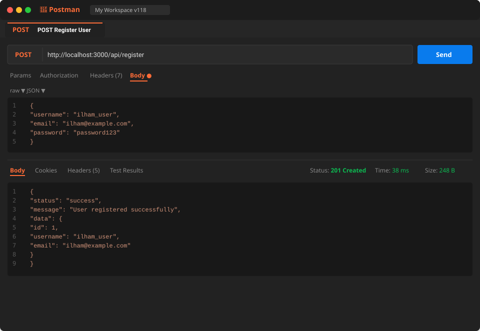
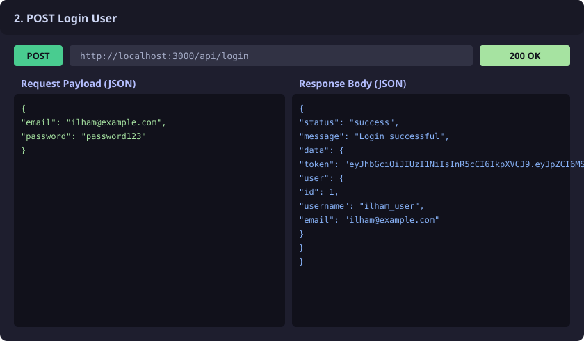
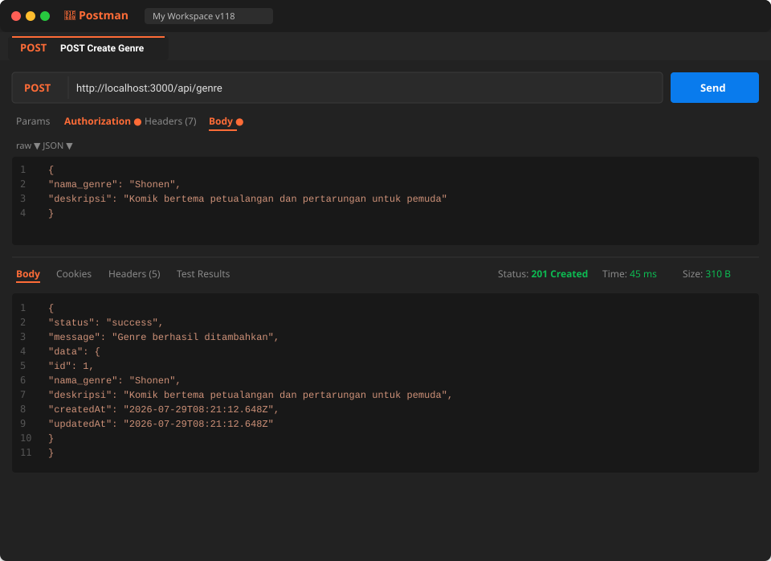
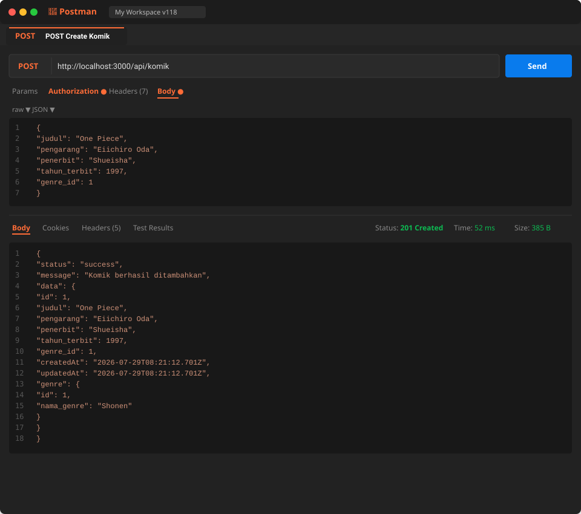
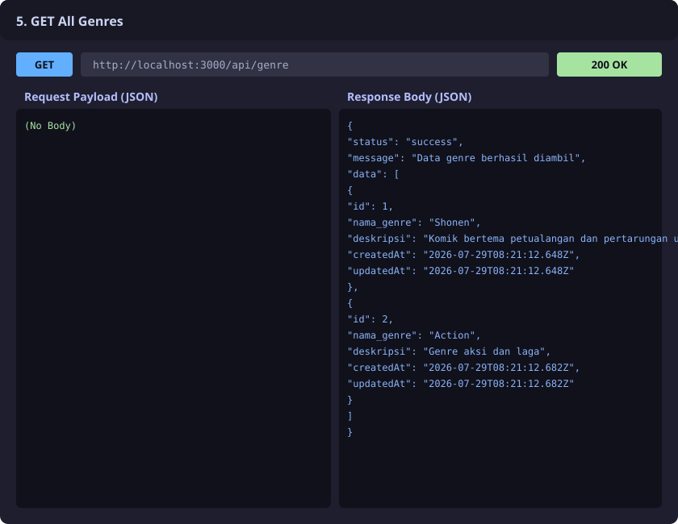
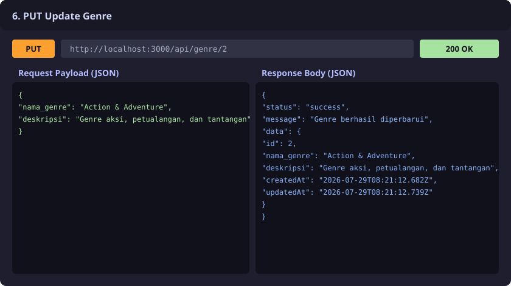
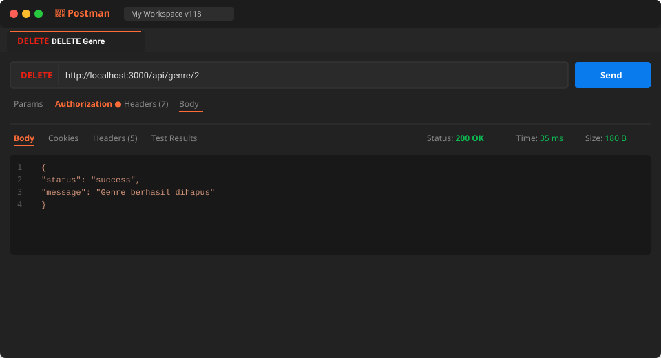
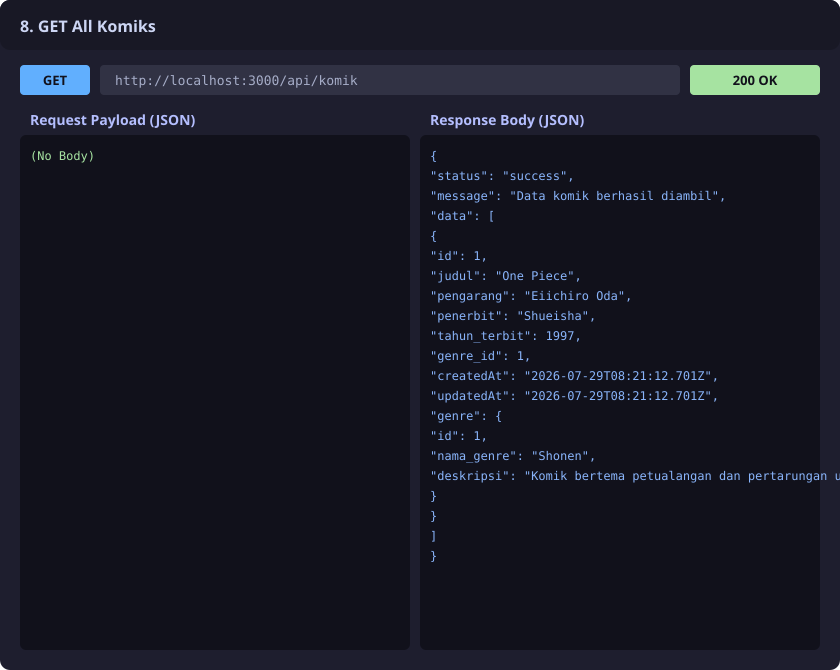
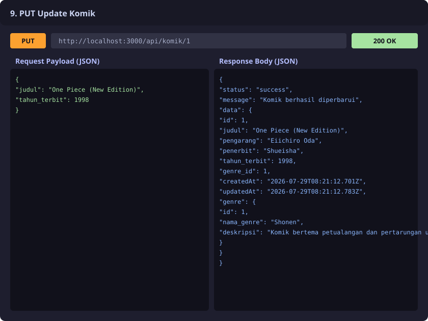
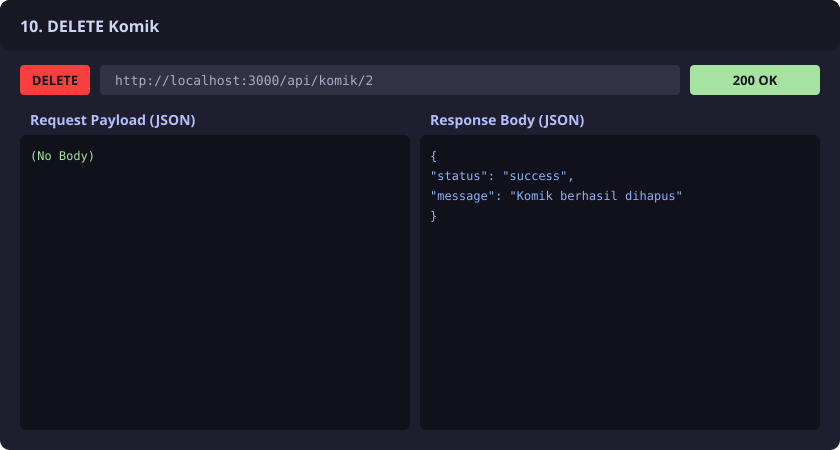

# 118_APIKomik - RESTful Web Service API Komik & Genre

API RESTful untuk pengelolaan Komik dan Genre dengan Autentikasi JWT (JSON Web Token), menggunakan Node.js, Express framework, Sequelize ORM, dan database PostgreSQL.

---

## 📌 Ketentuan Tugas (Praktikum 7)
- **Nama Repository**: `118_APIKomik`
- **Minimal Commit**: ≥ 20 Commits
- **Fitur API**: User Register, Login JWT, CRUD Genre, CRUD Komik (dengan relasi Genre).
- **Dokumentasi Screenshot**: Menyediakan screenshot pengujian endpoint di `README.md`.

---

## 🛠️ Teknologi & Libary
- **Runtime**: Node.js
- **Framework**: Express.js
- **ORM**: Sequelize
- **Database**: PostgreSQL (Auto-create Database Support)
- **Autentikasi & Keamanan**: `jsonwebtoken` (JWT), `bcrypt`
- **Variabel Lingkungan**: `dotenv`

---

## 🗄️ Skema Database & Relasi Model

1. **User (`users`)**: `id`, `username`, `email`, `password`, `createdAt`, `updatedAt`
2. **Genre (`genres`)**: `id`, `nama_genre`, `deskripsi`, `createdAt`, `updatedAt`
3. **Komik (`komik`)**: `id`, `judul`, `pengarang`, `penerbit`, `tahun_terbit`, `genre_id` (Foreign Key -> `genres.id`), `createdAt`, `updatedAt`

> **Relasi**: Genre `hasMany` Komik (`genre_id`), Komik `belongsTo` Genre.

---

## 🚀 Panduan Jalankan Project

### 1. Clone Repository & Install Dependencies
```bash
git clone https://github.com/ilham101106/118_APIKomik.git
cd 118_APIKomik
npm install
```

### 2. Konfigurasi File Environment
Buat file `.env` berdasarkan `.env.example`:
```env
PORT=3000
DB_NAME=api_komik_db
DB_USER=postgres
DB_PASSWORD=postgres
DB_HOST=localhost
DB_PORT=5432
JWT_SECRET=supersecretkey_118_apikomik
```

### 3. Jalankan Aplikasi
- Mode Development:
  ```bash
  npm run dev
  ```
- Mode Production / Start:
  ```bash
  npm start
  ```

---

## 📡 Daftar Endpoint API

| Method | Endpoint | Description | Auth Required |
| :--- | :--- | :--- | :---: |
| `POST` | `/api/register` | Registrasi akun user baru | ❌ No |
| `POST` | `/api/login` | Login user & dapatkan JWT Token | ❌ No |
| `POST` | `/api/genre` | Menambah data Genre baru | 🔒 Yes (JWT) |
| `GET` | `/api/genre` | Mengambil seluruh data Genre | ❌ No |
| `GET` | `/api/genre/:id` | Mengambil detail Genre berdasarkan ID | ❌ No |
| `PUT` | `/api/genre/:id` | Mengubah data Genre berdasarkan ID | 🔒 Yes (JWT) |
| `DELETE` | `/api/genre/:id` | Menghapus Genre berdasarkan ID | 🔒 Yes (JWT) |
| `POST` | `/api/komik` | Menambah data Komik baru | 🔒 Yes (JWT) |
| `GET` | `/api/komik` | Mengambil seluruh data Komik (termasuk Genre) | ❌ No |
| `GET` | `/api/komik/:id` | Mengambil detail Komik berdasarkan ID | ❌ No |
| `PUT` | `/api/komik/:id` | Mengubah data Komik berdasarkan ID | 🔒 Yes (JWT) |
| `DELETE` | `/api/komik/:id` | Menghapus Komik berdasarkan ID | 🔒 Yes (JWT) |

---

## 📸 Dokumentasi Screenshot Pengujian Endpoint

Berikut adalah dokumentasi hasil pengujian response API untuk setiap endpoint yang diwajibkan:

### 1. POST Register User


### 2. POST Login User


### 3. POST Genre (Tambah Genre)


### 4. POST Komik (Tambah Komik)


### 5. GET Genre (Lihat Seluruh Genre)


### 6. PUT Genre (Update Genre)


### 7. DELETE Genre (Hapus Genre)


### 8. GET Komik (Lihat Seluruh Komik)


### 9. PUT Komik (Update Komik)


### 10. DELETE Komik (Hapus Komik)


---

## 📝 Pengujian Otomatis
Jalankan skrip pengujian API bawaan:
```bash
node test_api.js
```
